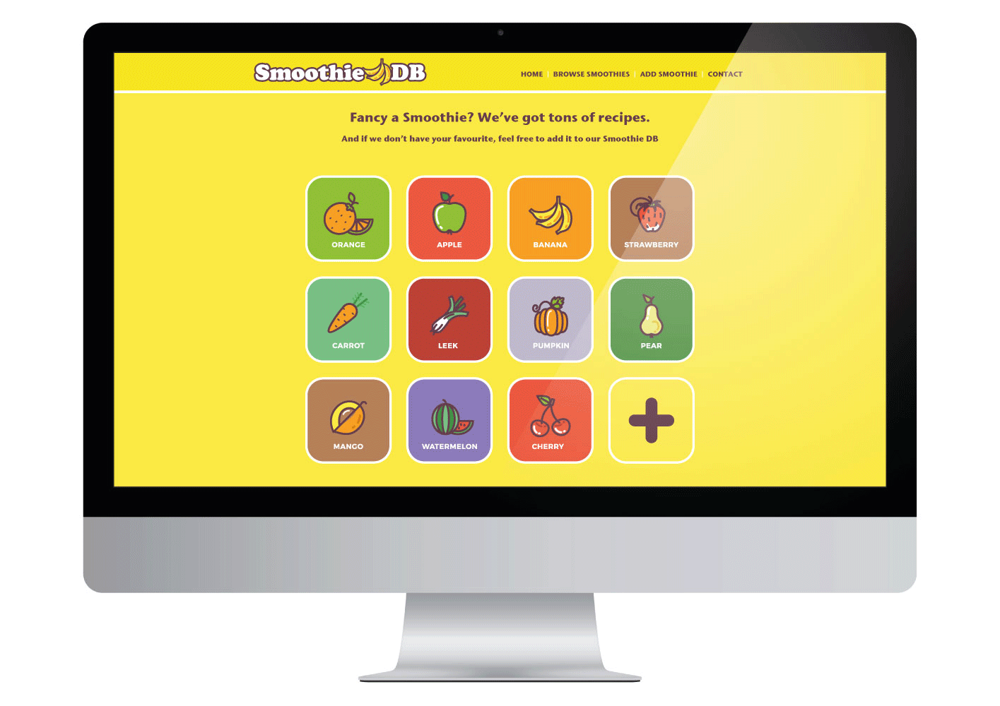

# SmoothieDB

SmoothieDB is a database of smoothie recipes by a lover of smoothies and for all lovers of smoothies.

A smoothie is a thick and creamy beverage made from pureed raw fruit, vegetables, and sometimes dairy products (e.g. milk, yogurt, ice-cream or cottage cheese), typically using a blender. Smoothies may be made using other ingredients, such as water, crushed ice, fruit juice, sweeteners (e.g. honey, sugar, stevia, or syrup), whey powder, plant milk, nuts, nut butter, seeds, tea, chocolate, herbal supplements, or nutritional supplements. A smoothie containing dairy products is similar to a milkshake, though the latter typically contains less fruit and often uses ice cream or frozen yogurt. 

SmoothieDB a simple beautiful App that allows users to look up recipes that include their search-term (i.e. main ingredient or taste). Users can alos upload their own favourite smoothie recipes to the database, thus growing the App and sharing their favourites with others.

## UX

#### User Stories
 
- I love smoothies - the taste, the health benefits and the ease that they can be whipped up in no time at all. I love trying new recipes, but sometimes they're hard to come by, and if you do find recipes online, you'e bombarded with click-bait and other distractions. I'd like a one-stop-shop for smoothie recipes.

- Anne is a primary school teacher who is trying to encourage the introduction of more fruits and vegatables to her pupils diet. She is looking for a App that is colourful, child-friendly and user-friendly for the kids to use.

- Tom works at home and eats on the go, but sometimes just opens the fridge/press and reaches for the wrong things. With an App like SmoothieDB he has healthy recipes at his fingertips and can get an quick meal in no time at all.

#### Design Considerations

The design of SmoothieDB instantly greets users with fun colour and eye catching simple icons that spell out recipe contents.

#### Responsive Design

The App is designed to work on all devices.

Proposed layout -

## Features

#### Navigation
- Simple navbar navigation with use of Materialize CSS for sidenav on smaller screens.

#### Possible feature to implement
- Extra features that could be implemented over time as the DB grows bigger, would be extra data visualisation using crossfilter and d3/dc libraries to display the amounts of recipes containing similar ingredients, etc.

## Technologies Used

- [Python](https://www.python.org/) - SmoothieDB is Python App

- [Flask](http://flask.pocoo.org/) - Flask is a microframework for Python based on Werkzeug and Jinja 2

- [MongoDB](https://www.mongodb.com/) - The most popular database for modern Apps

- [Pymongo](https://api.mongodb.com/python/current/) - PyMongo is a Python distribution containing tools for working with MongoDB, and is the recommended way to work with MongoDB from Python

- [Materialize CSS](https://materializecss.com/) - This App utilises HTML to construct page elements and uses Materialize CSS for base styling. Default Materialize CSS is used throughout and further styled with the file - /static/css/style.css

- [JQuery](https://jquery.com) - The project uses **JQuery** to enable features of Materialize CSS

- [Javascript](https://www.javascript.com/) - The App uses Javascript to trigger some features of Materialize CSS, i.e. sidenav flyout, dropdown select for categories and modal display of recipes. Javascript also used for a tricky button which hopes to deter deletion of recipes.

## Testing

#### User Stories addressed

- The App addresses the needs/wants of submitted user stories admirably. The App is easy to use and find recipes. The App is child friendly and easy to use for all ages.

#### Design

- The responsiveness of the App was tested in MAC OSX Safari, Firefox and Chrome browser windows at varying sizes and displays as intended/desired.

- The responsiveness of the App was tested in iPhone6 Chrome and Safari Apps and displays as intended/desired.

- Also tested on a random selection of phones, tablets and desktop browsers using https://www.browserstack.com/
extension in Firefox.

#### Code

- HTML code checked with validator.W3.org returns -
    - Document checking completed. No errors or warnings to show.

- CSS code checked with jigsaw.w3.org/css-validator returns -
    - Congratulations! No Error Found.

- Javascript checked through JSHint.com returns no errors

## Deployment

The live App is deployed to Heroku for review

NEED TO COMPLETE THIS

## Credits

#### Content
- The recipes uploaded to SmoothieDB are sourced online and input directly into MongoDB account.

#### Media
- The MongoDB logo is designed by the developer Barry Cunningham

- The icon images base items were purchased from [VectorStock](https://www.vectorstock.com/) and further images were created by the developer Barry Cunningham in the same style to complement the existing ones. A total of 60 icons are preloaded awaiting new user smoothies and if there's no match, a default image is used.

#### Acknowledgements

- The idea for SmoothieDB is my own.

- I received much support from Code Institute Tutors and from the Code Institute Slack community and am very greatful for same.